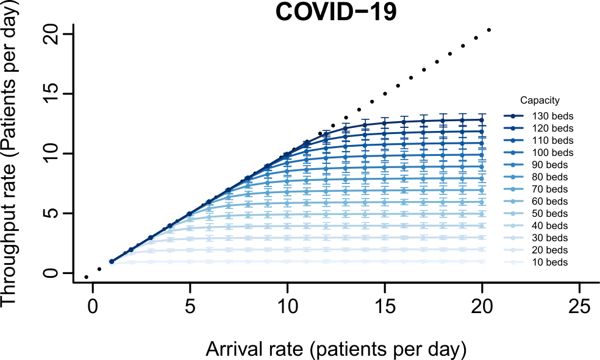
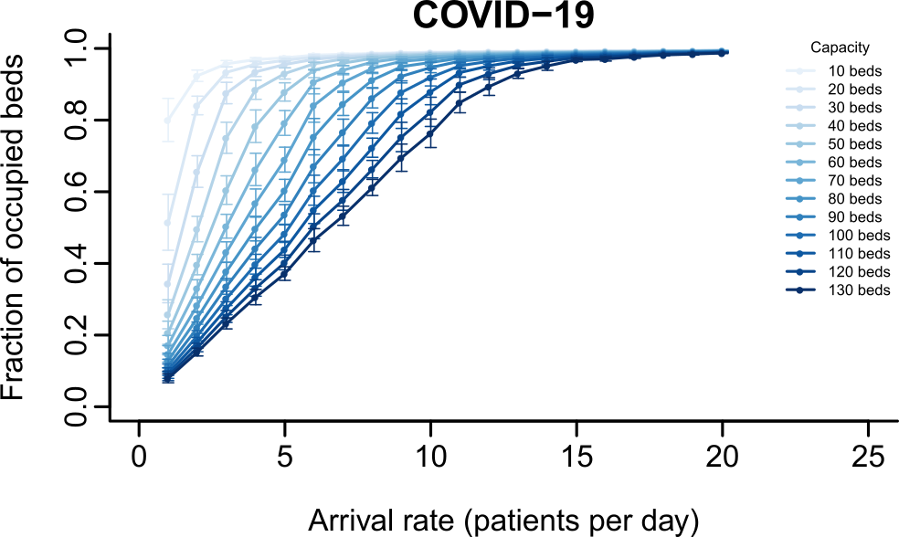
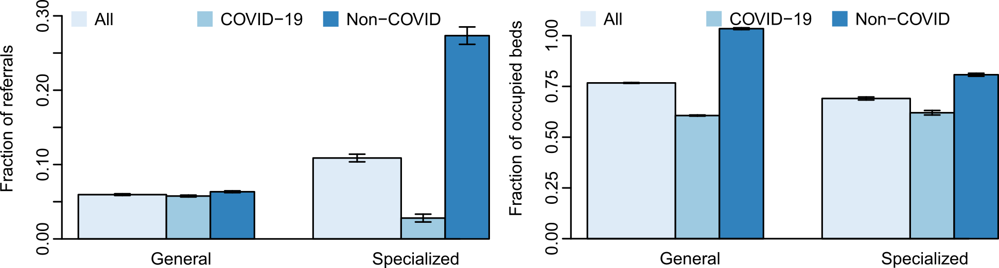

# ICU capacity management during the COVID-19 pandemic using a process simulation (icu-covid-sim)

## AUTHORS:

Andres Alban*; Stephen E Chick*, PhD; Dave A. Dongelmans**, MD, PhD; Alexander F. van der Sluijs**, MD; W. Joost Wiersinga**** MD, PhD, MBA; Alexander P.J. Vlaar**, MD, PhD, MBA; Danielle Sent***, PhD

 *INSEAD Technology and Operations Management
** Amsterdam UMC (location AMC) Intensive Care Medicine
*** Amsterdam UMC (location AMC) Medical Informatics
**** Amsterdam UMC (location AMC) Infectious Disease Medicine

NOTE: Code provided as is for noncommercial, academic usage only.

This repository contains R/Rstudio/Shiny implementation of the decision support tool described in 'ICU capacity management during the COVID-19 pandemic using a process simulation' by the authors above.

The application has been deployed at: https://andres-alban.shinyapps.io/icu-covid-sim/.
The main readme for this repo is ([README.md](README.md)).
Examples of USAGE of the tool is at ([README-AppB.md](README-AppB.md)).

# Appendix A: More background on conceptual model

This ICU decision support tool for ICU capacity planning for COVID crisis is designed to support ICU capacity decisions for COVID-19 and for non-COVID unplanned patients, using tools from operations research (queue and process simulation).

## Abstract

Introduction: The current COVID-19 pandemic leads to a massive influx of patients to the ICU. Epidemic models focus on the demand for care capacity. Here, we present a model for the number of COVID-19 and non-COVID-19 patients that can be served for a given ICU capacity. The results may give direction to expansion decisions during the pandemic. Methods: We adapted a stochastic patient flow simulation model, originally designed to assess performance metrics for ICU design decisions, to support capacity management decisions for hospitals that are trying to assess the impact of a sustained increase in ICU demand for COVID-19 patients. We also account for the impact on such decisions for the ability to provide acceptable service levels to other ICU patients. Results: We report potential COVID-19 patient flow rates for a range of potential COVID-19 patient arrival rates and ICU capacity and estimate non-COVID-19 unplanned patient ICU capacity, based on data from the Amsterdam University Medical Centres, location AMC. We provide a link to web-based code for other hospitals to use.

## Introduction

Epidemiological models for the current COVID-19 pandemic [1] and related communicable diseases [e.g., 2] suggest a dire picture if the epidemic is not controlled. Non-pharmaceutical interventions have assessed different strategies for ‘flattening the curve,’ which show how social distancing and other measures can reduce the basic reproduction number, R0 (by reducing contact rates, the probability of infection per contact, or the duration of time over which an infectious individual remains). These models can be enhanced by allowing for stochastic effects, social network structures, and interventions such as contact tracing [3-6]. Broadly speaking, epidemic models tend to focus on how infectious disease transmission and control change the peak and total incidence, and the duration of time that incidence exceeds a given threshold capacity. Such models help describe demand patterns through time for health resources but do not always predict the effect of care capacity constraints on disease progression and mortality (some exceptions exist, e.g., [7]).

The ability of care systems to confront the COVID-19 outbreak is a question of effective matching of the supply of resources with the demand of care, including that for ICUs. Halting elective nonurgent care demand can convert existing capacity, as might the creative use of discharge from ICU patients to other flexible resources when deemed appropriate. Despite these and other creative process improvements in ICUs [8], much more supply may be needed as the COVID-19 arrival rate increases. Measures considered include conversion of Post Anaesthesia Care Unit (PACU) space to ICU space, supported by OR teams to support ICU activities, implementation of emergency medical tents, or more generally learnings from prior reports following an influenza epidemic [9]. For example, the Amsterdam University Medical Centers, location AMC, has increased ICU capacity from 28 beds during regular times to 59 beds at location AMC, at the moment, in anticipation of a potentially massive increase in COVID-19 patients requiring ICU care.

We provide a supply-side simulation model of ICU capacity, as a complement to the demand-side epidemiological models, to help support ICU capacity expansion decisions in order to match treatment capacity with treatment demand. The need for such a tool customized to support local and regional decision making is highlighted by the high variability of critical care bed numbers across geographies [10-11].
The model allows ICU managers to assess performance metrics as a function of the number of fully resourced ICU beds for COVID-19 and non-COVID-19 patients and the rate of COVID-19 patients presenting to the ICU. Performance metrics include the bed occupancy rates, the probability of needing to refer a patient to other facilities due to capacity constraints, and throughput rates. This work, therefore, contributes to the health care operations management and simulation fields [12-14].

## Methods

We adapted a previously developed computer simulation model [15] of patient occupancy of ICUs to support hospitals in their capacity decisions for how many beds should be allocated to COVID-19 and non-COVID-19 patients, in the presence of ongoing random arrivals of urgent, unplanned ICU patients. Because lengths of stay (LOS) and demand streams for ICU care needs have statistical variation, we use a stochastic queuing model for patient flows in the ICU, consistent with guidance on assessing cost-benefit analysis for health technology assessment [16].

The statistical distribution on LOS for non-COVID patients was adapted from AMC ICU data on patient admissions and rejections for the years 2015-2016. We adapted the distribution for COVID-19 patients from recent literature [17]: LOS with a median of 8 days, and an interquartile range (IQR) of 8 days, with log-logistic distribution, capped at 28 days.

We varied the number of ICU beds for two resources, one designed to handle urgent, unplanned ICU cases that the AMC ICU would normally receive, and another designed to respond to the COVID-19 crisis. As mentioned earlier, nonurgent planned patients were rescheduled, so they did not consume ICU resources during the simulated period.

We also varied the anticipated demand rate of COVID-19 ICU patients, in order to assess how bed capacity and the rate of COVID-19 arrivals influence (a) the fraction of both urgent care and COVID-19 patients which would need to be referred to other facilities due to capacity constraints, (b) the occupancy rate, or fraction of beds which would be actively utilized during the planning period. These statistics were estimated as long-run average performance statistics, as they are useful comparative metrics for capacity planning decisions.

## Results

We first explored how COVID-19 ICU bed capacity interacts with variability in COVID-19 patient arrivals and LOS to determine the maximum throughput of COVID-19 patients in the ICU.  Figure 1 displays the throughput rate of COVID-19 patients (patients per day) on the vertical axis, as a function of the arrival rate of COVID-19 patients per day, and as a function of the number of beds dedicated to COVID-19 patients. Patient throughput rates would equal the patient arrival rates (the diagonal dotted line) if all patients were to be admitted to the ICU. A higher bed capacity results in a higher ability to admit patients; however, variation in patient arrival rates and LOS mean that some patients cannot be admitted and need to be referred to another hospital. The lines represent theoretical results for long-term average performance for the queueing system. The error bars represent plus or minus one standard deviation due to random variation over a 3-month period (duration chosen to match an estimate of the duration of the COVID-19 demand peak). The graph shows that with 5 COVID patients per day or less arriving, almost all can be admitted with 60 or more beds reserved for COVID patients. With 90 beds, approximately 8 COVID patients per day could be admitted, and only 2% of patients would be referred to other facilities.

 
Figure 1: Average throughput rate in long-term of COVID patients per day as a function of the arrival rate and bed capacity. Throughput rate can be less than the arrival rate due to bed blocking.
<p\>

When then explored COVID-19 ICU bed occupancy as a function of bed capacity, COVID-19 arrival rates, and variability in arrival times and patient LOS. Figure 2 shows the average bed occupancy, for COVID-19 patients, for the same scenarios for arrival rates of patients per day, and bed capacities. Occupancy rates increase to 100% as arrival rates increase for this range of COVID-19 ICU bed capacity. Figure 2 shows that at 8 COVID-19 patients per day with a capacity of 90 beds, there is 87% utilization of those beds. From Figure 1, only 2% of those COVID-19 patients need to be referred to another facility. The number of COVID-19 beds was raised to 50 for COVID-19 at location AMC and to 94 total for both locations of Amsterdam UMC, to date.

 
Figure 2: Fraction of COVID-19 bed occupancy, on average.
<p\>

It is also important to assess the ability of the ICU to manage unplanned, non-COVID-19 ICU patients. Figure 3 shows performance characteristics for a department with ICU beds reserved for non-COVID emergencies. Arrival rates between 0.2 and 4 are displayed, reflecting the current reduced load of patients in part due to planned nonurgent surgeries being canceled. The estimated demand rate of unplanned non-COVID arrivals to the ICU was estimated at 2 per day, and 9 beds were reserved for them. Both performance metrics improve with increasing capacity.

 
Figure 3: Average throughput rate (left) and fraction of occupied beds (right) for non-COVID-19 patients as a function of the arrival rate and ICU capacity dedicated to non-COVID-19 patients.
<p\>

The separation of COVID-19 from non-COVID-19 patients in different units adds an operational constraint to ICU bed management. This constraint may have the effect of reducing the overall throughput of patients, or of increasing the fraction of patients which may need a referral to other facilities. Figure 4 shows that this is indeed the case. This figure was performed through additional analysis which was not computed in the public shiny app.

 
Figure 4: Separation of COVID-19 and other ICU patients increases the need to refer patients to other facilities, even if overall bed occupancy rates are the same, as compared to operating without the need to isolate COVID-19 patients
<p\>

## Discussion

Epidemic models illustrate how public health and nonpharmaceutical interventions can influence the burden on hospitals through time for ICU care demand. Flattening the curve has the promise to decrease the demand rate for ICU services for COVID-19 patients but may extend the amount of time required to respond to that demand.

Our model takes a supply-side approach: that of evaluating ICU performance as a function of the bed capacity for ongoing flows, such as unplanned urgent cases, and bed capacity reserved or created for COVID-19 patients. Such capacity limits and patient-level variation in arrivals and LOS determine the degree of need to refer patients to alternative care departments or facilities. The dynamics of these effects are nonlinear once basic minimal capacity levels are obtained.

We applied this model with data for the Amsterdam UMC, location AMC. We have made an online application available for other hospitals to support capacity decisions at https://andres-alban.shinyapps.io/icu-covid-sim/.

## Acknowledgments

AA, SEC, and WJW acknowledge funding from the European Union’s Horizon 2020 research and innovation program under the Marie Skłodowska-Curie ESA-ITN grant agreement No 676129.

## Authorship Roles

AA, SEC, DS: developed mathematical model. AA: ran computer experiments. SEC: first draft of manuscript. WJW, DAD, AFvdS, WJW, APJ Vlaar: medical expertise, data on ICU. All: final editing.

## References

1. Ferguson, N, et al. (2020) Impact of non-pharmaceutical interventions (NPIs) to reduce COVID19 mortality and healthcare demand, Imperial College London. https://doi.org/10.25561/77482

2. Halloran, M. Elizabeth, Neil M. Ferguson, Stephen Eubank, Ira M. Longini Jr., Derek AT Cummings, Bryan Lewis, Shufu Xu, Christophe Fraser, Anil Vullikanti, Timothy C. Germann, Diane Wagener, Richard Beckman, Kai Kadau, Chris Barrett, Catherine A. Macken, Donald S. Burke, and Philip Cooley (2008) Modeling targeted layered containment of an influenza pandemic in the United States, PNAS March 25, 2008 105 (12) 4639-4644; https://doi.org/10.1073/pnas.0706849105

3. Koopman JS, G Jacquez, SE Chick (2001) New Data and Tools for Integrating Discrete and Continuous Population Modeling Strategies, In Population Health and Aging: Strengthening the Dialog between Epidemiology and Demography.  M. Weinstein, A. Hermalin, M.A. Stoto Eds. Annals of the New York Academy of Sciences, 954: 268-294. https://doi.org/10.1111/j.1749-6632.2001.tb02756.x

4. Fraser, C, S Riley, RM Anderson, NM Ferguson (2004) Factors that make an infectious disease outbreak controllable, PNAS April 20, 2004, 101(16) 6146-6151; https://doi.org/10.1073/pnas.0307506101

5. Germann, TC, K Kadau, IM Longini, Jr., CA Macken (2006) Mitigation strategies for pandemic influenza in the United States, PNAS 103(15):5935-5940. https://www.pnas.org/content/103/15/5935

6. Barnaby EY, et al, Singapore 2019 Novel Coronavirus Outbreak Research Team (2020) Epidemiologic Features and Clinical Course of Patients Infected With SARS-CoV-2 in Singapore, JAMA. Published online March 3, 2020. https://jamanetwork.com/journals/jama/fullarticle/2762688

7. Wein, LM, DL Craft, Edward H Kaplan (2003) Emergency response to an anthrax attack. PNAS April 1, 2003 100 (7) 4346-351; https://doi.org/10.1073/pnas.0636861100

8. van der Sluijs AF, ER van Slobbe-Bijlsma, SE Chick, MB Vroom, DA Dongelmans, APJ Vlaar (2017) The impact of changes in intensive care organization on patient outcome and cost effectiveness - A narrative review, Journal of Intensive Care, 5(13). https://dx.doi.org/10.1186/s40560-016-0207-7

9. Sprung, C.L., Zimmerman, J.L., Christian, M.D. et al. (2010) Recommendations for intensive care unit and hospital preparations for an influenza epidemic or mass disaster: summary report of the European Society of Intensive Care Medicine’s Task Force for intensive care unit triage during an influenza epidemic or mass disaster. Intensive Care Med 36, 428–443. https://doi.org/10.1007/s00134-010-1759-y

10. Rhodes, A., Ferdinande, P., Flaatten, H. et al. (2012) The variability of critical care bed numbers in Europe. Intensive Care Med 38, 1647–1653. https://doi.org/10.1007/s00134-012-2627-8

11. Austin, S., Murthy, S., Wunsch, H. et al.  (2014) Access to urban acute care services in high- vs. middle-income countries: an analysis of seven cities. Intensive Care Med 40, 342–352. https://doi.org/10.1007/s00134-013-3174-7

12. Jun, J.B., Jacobson, S.H., Swisher, J.R. (1999) Applications of Discrete Event Simulation in Health Care Clinics: A Survey, Journal of the Operational Research Society, 50(2), 109-123.

13. Brandeau ML, Sainfort F, and WP Pierskalla, Eds. (2004) Operations Research and Health Care: A Handbook of Methods and Applications. Kluwer Academic Publishers, Norwell, MA.

14. Law AM, WD Kelton (2007) Simulation Modeling and Analysis, 4th edition, McGraw Hill. New York.

15. Alban A, Chick SE, Lvova O, Sent D (2020) A simulation model to evaluate the patient flow in an intensive care unit under different levels of specialization, invited submission to Proc. 2020 Winter Simulation Conference, KH Bae, et al, eds. IEEE. Piscataway, NJ. https://ssrn.com/abstract_id=3565826

16. Brennan A, SE Chick, R Davies (2006) A Taxonomy of Model Structures for Economic Evaluation of Health Technologies, Health Economics, 15(12): 1295--1310. https://doi.org/10.1002/hec.1148

17. Zhou F, T Yu, R Du, et al. (2020) The Lancet, Clinical course and risk factors for mortality of adult inpatients with COVID-19 in Wuhan, China: a retrospective cohort study, The Lancet, 395(10229): 1054-1062, March 28, 2020, https://doi.org/10.1016/S0140-6736(20)30566-3

