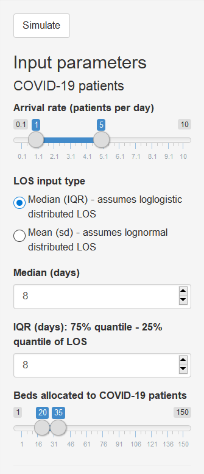
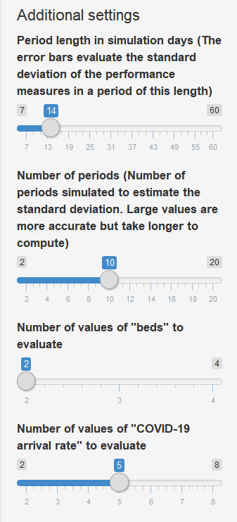

# ICU capacity management during the COVID-19 pandemic using a process simulation (icu-covid-sim)

## AUTHORS:

Andres Alban*; Stephen E Chick*, PhD; Dave A. Dongelmans**, MD, PhD; Alexander F. van der Sluijs**, MD; W. Joost Wiersinga**** MD, PhD, MBA; Alexander P.J. Vlaar**, MD, PhD, MBA; Danielle Sent***, PhD

 *INSEAD Technology and Operations Management
** Amsterdam UMC (location AMC) Intensive Care Medicine
*** Amsterdam UMC (location AMC) Medical Informatics
**** Amsterdam UMC (location AMC) Infectious Disease Medicine

NOTE: Code provided as is for noncommercial, academic usage only.

This repository contains R/Rstudio/Shiny implementation of the decision support tool described in 'ICU capacity management during the COVID-19 pandemic using a process simulation' by the authors above.

The application has been deployed at: https://andres-alban.shinyapps.io/icu-covid-sim/.
The main readme for this repo is ([README.md](README.md)).
See also motivation and conceptual model at ([README-AppA.md](README-AppA.md)). This builds upon prior work for ICU patient simulations [1].

# Appendix B: Example Usage of icu-covid-sim

This ICU decision support tool for ICU capacity planning for COVID crisis is designed to support ICU capacity decisions for COVID-19 and for non-COVID unplanned patients, using tools from operations research (queue and process simulation).

The model provides statistics about the stochastic patient flow in an ICU assuming that one set of ICU beds is reserved for COVID-19 patients, and another set of beds is reserved for non-COVID-19 patients (also called ‘Other patients’). The model assumes independent M/G/c/c queues for COVID-19 and non-COVID-19 patients.

The model is implemented in the R programming language [2] using RStudio [3] and RShiny [4] and is provided as is without warranty. The model was made available at https://andres-alban.shinyapps.io/icu-covid-sim/.

Parameters are entered as follows.

  
  

## Inputs to describe the model

Click the 'Simulate' button only AFTER all parameter values have been set. Simulation results may take up to a minute to appear.

The number of ICU beds, arrival rates, and length of stay (LOS) statistics for COVID-19 patients is specified separately from the information from non-COVID-19 patients. The assumption is that patients are routed based on COVID-19 status. ICU beds dedicated for COVID-19 patients are not used for non-COVID-19 patients and vice versa.

### Parameters for COVID-19 patients.

#### Arrival rate (patients per day)

Select a lower and upper bound to test for the average arrival rate of patients per day. We understand this may vary as the pandemic evolves. This is for testing a range of values that the facility might face in terms of demand for its services.

Technical note: we assume arrivals are a Poisson process (in other words, with exponentially distributed interarrival times).

#### LOS input type.

To compute the burden on ICU resources for COVID-19 patients, specify the length of stay (LOS) distribution. This can be specified in one of two different ways.

Median (IQR): assumes a log-logistic distribution for LOS with the given median, and interquartile range (25% to 75% range)

Mean (sd): assumes a lognormal distribution for LOS, such the LOS for patients will have the given mean and standard deviation.

Default values for the LOS distributions for COVID-19 patients are assumed to be log-logistic (if median and IQR are entered) or lognormal (if mean and sd are entered) with parameters which may differ from the non-COVID patients. LOS for individual patients is truncated at 28 days for purposes of the analysis.  For the analysis reported in the paper for Amsterdam UMC, site AMC, we used data from recent literature for COVID-19 positive patients (Zhou et al 2020): LOS with median of 8 days, IQR=8 days, with log-logistic distribution capped at 28 days. You can edit that to adapt it to your local condition.

#### Beds allocated to COVID-19 patients

Specify the range of beds under consideration for capacity expansion to handle COVID-19 patients.

### Parameters for non-COVID-19 patients.

Parameters for the ICU capacity and usage for non-COVID-19 patients is handled slightly differently. This is because these rates might be more controllable by allowing different streams of patients, e.g., patients referred from different departments in the hospital, or different medical specialisms (examples: internal medicine, surgery).

#### Simplest case: one stream of non-COVID-19 patients

Specify the AVERAGE arrival rate per day of non-COVID-19 patients. These are assumed to arrive as a Poisson process (exponentially distributed interarrival times), so the number of arrivals in a day varies around the specified mean rate. Poisson process makes sense under the assumption that scheduled planned surgeries are cancelled.

LOS distributions can be specified for non-COVID-19 patients with a different distribution as compared to COVID-19 patients, but with a similar interface.

You can also specify a range of number of beds for non-COVID-19 patients to test.

For the simplest scenario, we assume that all non-COVID ICU patients are unplanned urgent patients with a single statistical distribution. This may be reasonable when all non-urgent planned elective surgeries are cancelled, for example.

#### Advanced case: several streams of non-COVID-19 patients
For the more complicated case of several streams of non-COVID patients with different arrival rate and LOS distributions you can specify the inputs separated by commas. The inputs for the LOS distribution for all streams have to be given in the same specifications, i.e., all with the median (IQR) or all with mean (sd) specification. The number of inputs for arrival rate and LOS have to be the same length and be entered in the same order, i.e., the first entry for arrival rate, LOS mean, and LOS sd corresponds to stream 1, the second set of entres to stream 2 and so on.

The following is an example of the input for three streams of patients where LOS inputs are given with mean and std. deviation. Stream 1 has an arrival rate of 1 patient per day, mean LOS of 4 days, and LOS std. deviation of 7 days; stream 2 has an arrival rate of 2 patient per day, mean LOS of 5 days, and LOS std. deviation of 8 days; and stream 3 has an arrival rate of 3 patient per day, mean LOS of 6 days, and LOS std. deviation of 9 days.

  

### Additional comments:

LOS for individual patients is truncated at 200 days for purposes of the analysis. In the analysis reported in the paper for Amsterdam UMC, site AMC, all ICU demand for planned care was presumed to be 0 due to cancellations of procedures. Only historical urgent ICU demand patterns were modelled with a lognormal distribution with mean 4.36 and sd 8.95 (this corresponds to a log-mean 0.52 and log-sd 1.46).

## Outputs from the model:

Click 'Simulate' once the inputs are selected. This may take a moment.

We compute outputs using theoretical results for queuing analysis (M/G/c/c queues) where possible, and otherwise compute results using Monte Carlo/stochastic simulations to estimate or to provide a sense of variation above and below theoretical mean values [5]. The outputs from the simulation model for the analysis reported in the paper are computed from steady-state simulations of 20 periods of 2 months each. The defaults model uses 10 periods of 14 days each that can be adjusted in the additional settings of the model.

Performance metrics computed include:

•	Throughput rate, for COVID-19 beds, defined as the number of patients per day that can go through the system:

  

•	Occupancy rates, for each of COVID-19 and Non-Covid-19 beds, defined to be the fraction of beds occupied on average through time:

  
  

•	Referral rates, non-COVID-19 beds, defined to be the fraction of patients who need to be referred to another hospital due to capacity issues.

  

.

Reducing the referral rate can be achieved, on average, by increasing the capacity or by decreasing the lengths of stay, for example. Statistical fluctuation can increase or decrease bed counts through time. The throughput rate increases with the arrival rate provided that enough beds are in place to maintain a low referral rate. Occupancy rates can inform decisions for initial capacity expansion plans, or for planning for potential ability to respond to additional spikes in demand.

Theoretical means are plotted together with bars that represent one standard deviation of values computed over a sequence of time periods whose number and length is specified by the parameters in 'additional settings'. They are not standard errors for estimates of the means (which are computed exactly from theoretical steady-state queueing analysis). Instead, they represent variations in the patient throughput rates, fraction of occupied beds, and fraction of referrals (due to bed blocking).

## Additional settings:

The simulations can be further controlled using several additional parameters.

  

### Period length in simulation days

The period length is the number of days simulated to compute the standard deviation of the performance measures. The theoretical means are long-run averages of the performance (steady-state) and the error bars around them represent the standard deviation for finite periods with the specified length.

### Number of periods

Number of periods says how many time periods are simulated to compute the standard deviation of the process statistics mentioned above.

### Number of values of numbers of "beds" to evaluate

The plots evaluate the performance for a range of bed capacity setups. This input specifies how many setups to evaluate within the range specified by the user. This setting is used for COVID and non-COVID.

### Number of values of "COVID-19 arrival rate" to evaluate

The plots for COVID-19 patients evaluate the performance for a range of arrival rates. This input specifies how many values to evaluate within the range specified by the user.

## References:

1. Alban A, Chick SE, Lvova O, Sent D (2020) A simulation model to evaluate the patient flow in an intensive care unit under different levels of specialization, invited submission to Proc. 2020 Winter Simulation Conference, KH Bae, et al, eds. IEEE. Piscataway, NJ. https://ssrn.com/abstract_id=3565826

2. R Core Team (2020). R: A language and environment for statistical computing. R Foundation for Statistical Computing, Vienna, Austria. URL https://www.R-project.org/.

3. RStudio Team (2019). RStudio: Integrated Development for R. RStudio, Inc., Boston, MA URL http://www.rstudio.com/

4. Chang W, Joe Cheng, JJ Allaire, Yihui Xie and Jonathan McPherson (2020). shiny: Web Application Framework for R. R package version 1.4.0.2. https://CRAN.R-project.org/package=shiny

5. Law AM, WD Kelton (2007) Simulation Modeling and Analysis, 4th edition, McGraw Hill. New York.

